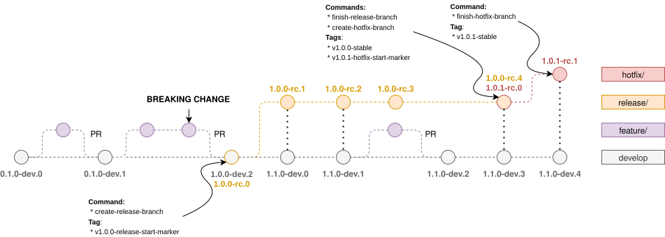

# semver.sh

This Bash script automates semantic versioning for Git branches following the GitFlow branching model, supporting a
flexible tag strategy. It's designed for CI pipelines, ensuring consistent versioning across development, release, and
hotfix branches. It also adapts to project-specific workflows, making it ideal for multi-project environments.

## Table of Contents

- [Key Features](#key-features)
- [Usage](#usage)
    - [Syntax](#syntax)
    - [Commands](#commands)
    - [Examples](#examples)
- [How It Works](#how-it-works)
    - [Tag Creation](#tag-creation)
    - [Versioning Rules](#versioning-rules)
- [CI/CD Integration](#cicd-integration)

## Key Features

### Branch-Based Versioning:

- **Continuous Development (develop):** Tracks the main line of development with `dev` pre-release versions, where the
  patch is always zero (e.g., 1.2.0-dev.5).
- **Release Preparation (release/\* & hotfix/\*):** Prepares for a final release using `rc` (Release Candidate)
  versions. Release branches start with a zero patch (1.2.0-rc.1), while hotfix branches calculate it (1.2.1-rc.1).
- **Final Releases:** The `finish-release-branch` and `finish-hotfix-branch` commands create the official production
  tag. The release type can be `stable` (default), `ga`, or `la`.
- **Pull/Merge Request Builds:** For CI validation, it generates a temporary pre-release version using the request
  number (e.g., for a Pull Request: 1.2.1-pr.42, for a Merge Request: 1.2.1-mr.42).

### Versioning Strategy Selection:

- **Commit Count:** Versions based on the number of commits since the last marker tag.
- **Request Number:** Versions based on the pull request or merge request number.

### Breaking Change Detection:

- **Automatically increments the major version when breaking changes are detected** using commit messages:
    - `!` symbol in the commit title (following [Conventional Commit](https://www.conventionalcommits.org/en/v1.0.0/)
      standards).
    - `BREAKING CHANGE` section in the commit body.
- **Optionally excludes breaking changes from specific authors** (e.g., `dependabot[bot]`).

### Project-Specific Workflows:

- Supports multiple GitFlow instances within a single repository.
- Allows independent versioning and release management for different projects or sub-projects using `*/`-prefixed
  branches (e.g., `project-a/develop`, `project-a/release/v1.0.0`).

### Robust Remote Handling:

- **Explicitly define which remote to interact with** for all fetch and push operations using the `--remote` option.
- **Intelligently auto-detects a default remote** (`origin` or the first available) if not specified, and fails early if
  no valid remote can be found.

## Usage

### Syntax

```
Usage: semver.sh <COMMAND> [OPTION]...

Commands:
  show-version                 Display the semantic version for the specified
                               branch or the current branch if none is
                               provided.
  show-changelog-range         Output the 'from' and 'to' Git refs for
                               generating a changelog.
  create-release-branch        Create a new release branch using the calculated
                               semantic version.
  create-hotfix-branch         Create a new hotfix branch for patching a stable
                               version.
  finish-release-branch        Finalize a release branch by tagging and marking
                               it as stable.
  finish-hotfix-branch         Finalize a hotfix branch by tagging and marking
                               it as stable.

Options:
  General Options:
        --project-name <name>  Project name to prefix branches and tags.
                               Defaults to an empty string.
        --base-version <version>
                               Base version to use if no tags are found.
                               Defaults to "0.1.0".
        --remote <name>        Remote repository to interact with.
                               Defaults to auto-detection
                               ('origin' or the first available).
        --json                 Output information in JSON format.
    -q, --quiet                Suppress detailed output showing the branches
                               and tags being created.
    -h, --help                 Display this help message and exit.

  show-version Options:
    (inherits General Options)
    -b, --branch <branch>      Branch to calculate the semantic version for.
                               Defaults to the current branch.
        --versioning-strategy <strategy>
                               Strategy for determining the pre-release version:
                                - commit-count (default)
                                - request-number
        --request-number <number>
                               The PR/MR number to use as the pre-release
                               increment. Required if
                               --versioning-strategy="request-number".
        --request-type <type>  Type of the request, either 'pr' for Pull Request
                               or 'mr' for Merge Request. Defaults to 'pr'.
        --skip-breaking-changes-from <author>
                               Ignore breaking changes from a specific author
                               (e.g., dependabot[bot]).
                               Repeat the option to specify multiple authors.

  show-changelog-range Options:
    (inherits General Options)
    -b, --branch <branch>      Branch to get the changelog range for.
                               Defaults to the current branch.
        --bootstrap-ref <ref>  Used only for the first 'semver.sh'-tracked
                               release on a legacy project to specify a
                               starting point. This is ignored if a previous
                               'semver.sh' release is found.

  create-release-branch Options:
    (inherits General Options)
        --skip-breaking-changes-from <author>
                               Ignore breaking changes from a specific author
                               (e.g., dependabot[bot]).
                               Repeat the option to specify multiple authors.

  create-hotfix-branch Options:
    (inherits General Options)
    -b, --branch <branch>      Specify the branch of the stable version to
                               patch (e.g., release/v1.2.0).

  finish-release-branch Options:
    (inherits General Options)
    -b, --branch <branch>      Specify the release branch to finalize (e.g.,
                               release/v1.2.0).
        --release-type <type>  Type of release for the version:
                                - stable: a stable release (default)
                                - ga: general availability
                                - la: limited availability

  finish-hotfix-branch Options:
    (inherits General Options)
    -b, --branch <branch>      Specify the hotfix branch to finalize (e.g.,
                               hotfix/1.2.1).
        --release-type <type>  Type of release for the version:
                                - stable: a stable release (default)
                                - ga: general availability
                                - la: limited availability
```

### Commands:

#### 1. `show-version`

Calculates and displays the semantic version of a branch.

**Options:**

- `--branch <branch>`: Specifies which branch to calculate the version for (default: current branch).
- `--versioning-strategy <strategy>`: Determines the strategy for the pre-release version:
    - `commit-count` (default): Use the number of commits as the increment.
    - `request-number`: Use a pull or merge request number.
- `--request-number <number>`: The PR/MR number to use. Required if `--versioning-strategy=request-number`.
- `--request-type <type>`: Specifies the type of request, either `pr` (default) or `mr`.
- `--skip-breaking-changes-from <author>`: Exclude breaking changes from a specific author (e.g., `dependabot[bot]`).

#### 2. `show-changelog-range`

Outputs the Git references (`from` and `to`) for generating a changelog.

**Options:**

- `--branch <branch>`: Branch to get the range for. Defaults to the current branch.
- `--bootstrap-ref <ref>`: **For legacy projects only.** Specifies a commit SHA or tag to use as the starting point for
  the first `semver.sh`-tracked release. This avoids generating a massive changelog from the beginning of the
  repository's history.

#### 3. `create-release-branch`

Creates a new release branch with a version derived from the current state of the `develop` branch.

**Options:**

- Inherits the general options such as `--project-name` and `--base-version`.
- `--skip-breaking-changes-from <author>`: Exclude breaking changes from a specific author.

#### 4. `create-hotfix-branch`

Creates a hotfix branch to patch an existing release or hotfix branch.

**Options:**

- Inherits the general options such as `--project-name` and `--base-version`.
- `--branch <branch>`: The stable branch to patch (e.g., `release/v1.2.0`).

#### 5. `finish-release-branch`

Finalizes a release branch by tagging it and marking it as stable.

**Options:**

- Inherits the general options such as `--project-name` and `--base-version`.
- `--branch <branch>`: The release branch to finalize (e.g., `release/v1.2.0`).
- `--release-type <type>`: Defines the release type:
    - `stable` (default): A stable release.
    - `ga`: General availability.
    - `la`: Limited availability.

#### 6. `finish-hotfix-branch`

Finalizes a hotfix branch by tagging it and marking it as stable.

**Options:**

- Inherits the general options such as `--project-name` and `--base-version`.
- `--branch <branch>`: The hotfix branch to finalize (e.g., `hotfix/1.2.1`).
- `--release-type <type>`: Defines the release type:
    - `stable` (default): A stable release.
    - `ga`: General availability.
    - `la`: Limited availability.

### Examples

1. Calculate version based on commit count for `develop`:
   ```bash
   ./semver.sh show-version --branch "develop" --versioning-strategy "commit-count"
   ```

2. Calculate the version for a GitHub Pull Request targeting a `release` branch:
   ```bash
   ./semver.sh show-version --branch "release/v1.0.0" --versioning-strategy "request-number" --request-number "42" --request-type "pr"
   ```

3. Exclude breaking changes from `dependabot[bot]`:
   ```bash
   ./semver.sh show-version --branch "develop" --skip-breaking-changes-from "dependabot\[bot\]"
   ```

4. Support project-specific workflows:
   ```bash
   ./semver.sh show-version --project-name "project-a" --branch "project-a/release/v7.5.0" --versioning-strategy "commit-count"
   ```

5. Specify a base version for legacy repositories:
   ```bash
   ./semver.sh show-version --base-version "1.2.3" --branch "develop" --versioning-strategy "commit-count"
   ```

6. Specify a remote for all operations:
   ```bash
   ./semver.sh create-release-branch --remote "upstream"
   ```

7. Automate changelog generation:
   ```bash
   CHANGELOG_RANGE="$(./semver.sh show-changelog-range --branch release/v1.0.0)"
   git log "${CHANGELOG_RANGE}" --pretty=format:"- %s (%h)"
   ```

## How It Works

This diagram illustrates the GitFlow branching model and how `semver.sh` applies semantic versioning at each stage of
the development lifecycle:



### Tag Creation

When a release or hotfix branch is created, a start marker tag is created to mark the beginning of the branch:

* **[\<project-name\>-]v\*-release-start-marker**: Starting point for develop and release branches.
* **[\<project-name\>-]v\*-hotfix-start-marker**: Starting point for hotfix branches.

### Versioning Rules

1. **Develop Branch (`[<project-name>/]develop`)**
    - Pre-release type: `dev`
    - Increment major for breaking changes, minor otherwise.
    - Format: `\<major\>.\<minor\>.0-dev.\<increment\>`.

2. **Release Branch (`[<project-name>/]release/*`)**
    - Pre-release type: `rc`, or stable types `stable` (default), `ga`, `la`.
    - Patch version is always `0`.
    - Format: `\<major\>.\<minor\>.0-rc.\<increment\>` (before stable).

3. **Hotfix Branch (`[<project-name>/]hotfix/*`)**
    - Pre-release type: `rc`, or stable types `stable` (default), `ga`, `la`.
    - Patch version is calculated dynamically.
    - Format: `\<major\>.\<minor\>.\<patch\>-rc.\<increment\>` (before stable).

4. **Pull/Merge Requests**
    - Pre-release type: `pr` or `mr`.
    - The final version component is set to the request number.
    - Format for Pull Request: `\<major\>.\<minor\>.\<patch\>-pr.\<request-number\>`.
    - Format for Merge Request: `\<major\>.\<minor\>.\<patch\>-mr.\<request-number\>`.

## CI/CD Integration

We provide comprehensive guides and reusable workflows to integrate `semver.sh` into your CI/CD pipelines on both GitHub
and GitLab. These guides cover the full release lifecycle, including automated version calculation for builds and manual
triggers for creating and finishing release branches.

For detailed instructions and complete workflow examples, please see the platform-specific guides:

- **[GitHub Actions Integration Guide](.github/INTEGRATION-GUIDE.md)**
- **[GitLab CI/CD Integration Guide](.gitlab/INTEGRATION-GUIDE.md)**
